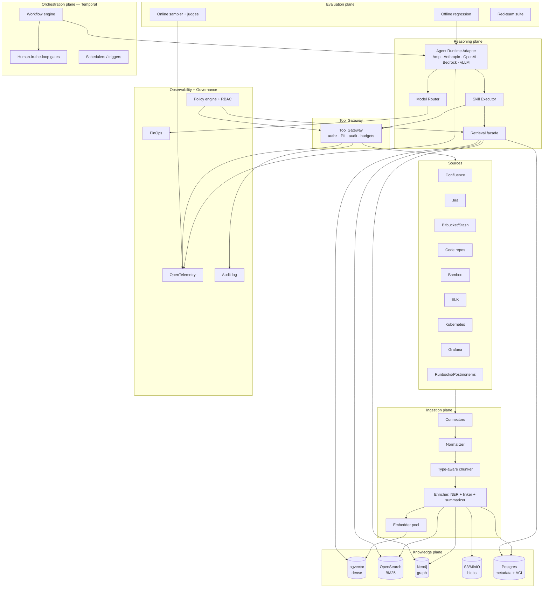

# Architecture Blueprint: Org-Wide Agentic Knowledge & Workflow Platform

> Response to `docs/design-prompt.md`. Opinionated. Reversible calls flagged.

---

## TL;DR — top 5 design decisions

| # | Decision | Rationale | Rejected alternative | What would reverse it |
|---|---|---|---|---|
| 1 | **Three-store hybrid retrieval** (pgvector + OpenSearch BM25 + Neo4j) behind one `Retrieval` facade | Code/log/doc queries each have a dominant retrieval mode; one store is always wrong somewhere. Facade keeps callers ignorant. | Single vector DB (Weaviate/Pinecone) | Org-wide vector-DB mandate, or <100k items total |
| 2 | **Temporal** for workflow orchestration; agent steps are Temporal activities | Durable execution, retries, human gates, signals, replay — table stakes for multi-hour agentic flows touching real systems. LangGraph is fine for in-process DAGs but loses on durability and ops maturity. | LangGraph / Prefect / homegrown queue+state machine | Sub-second latency dominates; flows always <30s |
| 3 | **Tool Gateway as a separate service** that proxies every MCP + internal API call; agents never speak MCP directly | One place for authz, PII scrub, cost budgets, audit, schema versioning. Lets us swap MCP↔gRPC↔REST under the same tool name. | Library/SDK that agents import | None — this is foundational. |
| 4 | **Skills = Markdown+frontmatter, Workflows = YAML, Runtimes = adapter interface** | Mirrors Claude Code's portable skill model; reviewable in PRs; same artifact runs on Amp, Anthropic, OpenAI, Bedrock, vLLM. | Python classes per skill, or LangChain chains | Agent authors prefer code-first and we lose non-engineer authors |
| 5 | **Reproducibility-by-construction**: every run pinned to `{workflow_v, skill_v, prompt_v, model_id, kb_snapshot_id, gateway_v}` | Without this you cannot debug a bad answer from yesterday or run A/B properly. Cheap if built in from day 1, painful to retrofit. | Best-effort logging | Storage cost becomes >5% of LLM cost (unlikely) |

---

## 1. High-level architecture



### Three example data flows

**(a) Ingest one Confluence page**
1. Confluence webhook → Connector enqueues `{space, pageId, version}` on `ingest.confluence` queue.
2. Connector pulls page via MCP, stores raw HTML in blob store, writes `KnowledgeItem` shell to metadata DB with `state=pending`.
3. Normalizer converts to canonical Markdown + structured front matter.
4. Chunker splits by H1/H2 with overlap; tags code blocks separately.
5. Enricher runs NER (services, repos, people, tickets) + entity linker against the graph; resolves "PaymentSvc" → `Service:payments-api`.
6. Embedder writes vectors to pgvector; lexical text to OpenSearch; entity/edge upserts to Neo4j; ACLs copied from Confluence space.
7. State flips to `live`. Tombstones any prior version. Emits `kb.item.indexed` event.

**(b) Dev: "Why did service X break after release 2.4.1?"**
1. Workflow `dev.explain-regression` started; input parsed for entities.
2. Retrieval facade issues parallel queries: graph (`Deploy{rel=2.4.1} → Service{name=X} → Alert{after}`), vector (semantic over postmortems + commits), BM25 (exact symbol/error string).
3. Agent reasons over fused, ACL-filtered results; calls Tool Gateway for `bamboo.get_build`, `elk.search_logs`, `git.diff_range`.
4. Produces answer with inline citations `[KI-83421]`; eval judge checks groundedness before return.
5. Full trace persisted: prompts, tool calls, KB snapshot id, cost.

**(c) QA: generate regression tests for PR**
1. Trigger: Bitbucket PR opened/updated webhook.
2. Workflow `qa.regression-plan` fetches diff via gateway, runs skill `impact-analysis` (graph walk: changed files → modules → services → consumers → past incidents touching same area).
3. Skill `risk-score` ranks impacted areas; skill `test-plan-draft` produces a Markdown plan with cited prior bugs.
4. Human gate: QA lead approves; on approval, skill `test-skeleton-codegen` opens a draft PR with stubbed tests.

---

## 2. Knowledge base design

### 2.1 `Source` interface

```ts
interface Source<TRaw> {
  id: string;                          // "confluence", "jira", "code:payments-api"
  kind: "pull" | "push" | "hybrid";
  watermark(): Promise<Watermark>;     // last-seen cursor
  list(since: Watermark): AsyncIterable<SourceRef>;  // incremental
  fetch(ref: SourceRef): Promise<TRaw>;
  toCanonical(raw: TRaw): Promise<KnowledgeItem[]>;  // 1→N
  acl(ref: SourceRef): Promise<ACL>;
}
```

Connectors are stateless; watermarks live in Postgres. Backfill = `list({since: 0})`.

### 2.2 Canonical `KnowledgeItem`

```ts
type KnowledgeItem = {
  id: string;                  // stable hash of source+uri+version
  source: string;
  uri: string;
  type: "doc" | "code" | "ticket" | "pr" | "commit" | "build" | "log" | "alert" | "dashboard" | "runbook";
  title: string;
  body: string;                // canonical markdown / text
  structured?: Record<string, unknown>;  // typed fields per type
  embeddings: { model: string; vec: number[] }[];
  entities: EntityRef[];       // linked graph nodes
  relations: EdgeRef[];        // emitted edges
  owners: Principal[];
  acl: ACL;
  parent_id?: string;          // for chunks
  chunk_of?: string;
  hash: string;                // content hash for dedup
  version: number;
  ts: { created: string; updated: string; source_updated: string };
  provenance: { connector: string; run_id: string };
  state: "pending" | "live" | "tombstoned";
};
```

### 2.3 Chunking per type

| Type | Strategy | Why |
|---|---|---|
| Code | AST-aware: one chunk per function/class/method + a file-level chunk; carry imports + JSDoc/JavaDoc | Symbol boundaries beat token windows; preserves callability |
| Markdown/Confluence | Heading-aware with 15% overlap; tables kept whole; code fences isolated | Preserves semantic boundaries |
| Jira | One chunk per event in the issue timeline; one summary chunk | Timeline > blob for incident reasoning |
| PR | Diff hunks individually + PR description + review threads | Hunks searched independently |
| Commit | Message + per-file diff summary | Same |
| Build log | Window around failure markers (50 lines pre/post) | Logs are too long to embed whole |
| ELK | Aggregate by incident window (alert ±15m); store representative samples | Embedding raw logs is wasteful |
| K8s | Per-manifest; events grouped per-object per-hour | Match how SREs query |
| Grafana | Panel + alert metadata + last 30 days of fires | Power correlation queries |

### 2.4 Enrichment pipeline

- **Entity extraction**: regex + dictionary for org-specific tokens (repo names, service names, env names) → LLM NER fallback. Cheap models (Haiku, Llama-8B) are fine here.
- **Entity linking**: deterministic lookup against the graph; ambiguous → store both candidates with confidence.
- **Cross-source linking**: extract Jira keys from commits/PRs/Confluence; extract PR ids from deploy notes; extract service names from alerts. Each becomes a graph edge.
- **Summarization**: per item, ≤200 tokens, for high-recall lexical search and for the agent's preview.
- **Taxonomy**: lightweight tag set (domain, lifecycle, sensitivity) curated by platform team; auto-suggested then confirmed.

### 2.5 Storage choices (the boring opinion)

| Concern | Choice | Why |
|---|---|---|
| Dense vectors | **pgvector** on same Postgres as metadata | Joins to ACL/metadata trivial; one less system; ANN good enough <10M items |
| Lexical/BM25 | **OpenSearch** | Mature, BM25 + filters, decent code tokenizer with custom analyzer |
| Graph | **Neo4j** (community → enterprise if needed) | Cypher is the right query language for traceability |
| Blobs | **S3/MinIO** | Raw payloads, debug artifacts |
| Metadata + ACL + watermarks | **Postgres** | Same DB as pgvector |
| Cache | **Redis** | Embedding cache, retrieval cache, rate limiting |
| Event bus | **NATS** or **Kafka** (pick by ops familiarity) | Ingestion + workflow signals |

> Reverse to a single vector DB only if (a) we drop graph reasoning or (b) org standardizes on one.

### 2.6 Freshness, cost, deletion

- **CDC** where available (Bitbucket/Jira/Confluence webhooks), polling fallback with `If-Modified-Since`.
- **Embedding cache** keyed on `(chunk_hash, embed_model)` → re-index cost ≈ delta only.
- **Dedup** by `hash`; cross-source dedup by normalized title + body shingles.
- **Tombstones** kept 30 days for trace replay; hard delete on GDPR/secret-leak path triggered by Policy engine.
- **Cost guardrails**: per-source monthly token budget; ingestion auto-degrades to summary-only when 80% consumed.

---

## 3. Knowledge graph for traceability

### 3.1 Schema

**Nodes**: `Repo, Module, Service, Commit, PR, Build, Deploy, Ticket, Alert, LogEvent, Dashboard, Person, Team, Doc, Runbook, Env`.

**Edges** (directed):

| Edge | From → To | Source signal |
|---|---|---|
| `OWNS` | Team/Person → Service/Repo/Module | CODEOWNERS, service catalog |
| `CONTAINS` | Repo → Module → Service | Build manifests |
| `AUTHORED` | Person → Commit/PR | VCS |
| `MERGES` | PR → Commit[] | VCS |
| `FIXES` / `MENTIONS` | Commit/PR → Ticket | message parse |
| `BUILDS` | Bamboo → Commit | CI metadata |
| `DEPLOYS` | Deploy → Service@Env | Bamboo/Argo |
| `EMITS` | Service → Alert/LogEvent | runtime |
| `WATCHES` | Dashboard → Service/Alert | Grafana |
| `CAUSED_BY` | Alert/Incident → Deploy/Commit | inferred (see 3.2) |
| `RELATES_TO` | * → Doc/Runbook | mention/link |
| `DEPENDS_ON` | Service → Service | runtime + manifests |

### 3.2 Causal resolver

Given any entity `E` and a time window `W`:

```
1. timeline(E, W) =
     all events where E ∈ subject ∨ E ∈ object,
     ordered by ts.
2. seed = {E} ∪ {nodes within 2 hops of E that touched W}
3. for each candidate (alert, log, fail) inside W:
     score = w1·temporal_proximity + w2·dep_graph_distance
           + w3·textual_overlap(stack/error vs commit diff)
           + w4·prior_incident_pattern_match
4. emit top-K with provenance edges; mark inferred CAUSED_BY with confidence
```

Weights are config + tuned against a labelled set in `eval/causal/`.

### 3.3 The `trace` tool (single agent-facing API)

```yaml
tool: trace
input:
  anchor: { kind: "ticket"|"pr"|"alert"|"commit"|"service", id: string }
  window: { from?: iso8601, to?: iso8601, lookback?: duration }
  depth: int = 2
output:
  timeline: Event[]
  inferred_causes: { node, confidence, evidence[] }[]
  citations: KnowledgeItemRef[]
```

This is the single primitive every workflow uses for cross-system tracing.

---

## 4. Agent & skill model (portable, runtime-agnostic)

### 4.1 SkillSpec — Markdown + frontmatter

```markdown
---
name: correlate-deploy-to-alert
version: 1.3.0
description: Given a Grafana alert, find candidate deploys that likely caused it.
owners: [team:platform-sre]
inputs:
  alert_id: { type: string, required: true }
  window:   { type: duration, default: 2h }
outputs:
  candidates: { type: array, items: { service, deploy_id, confidence, evidence[] } }
tools:
  - trace
  - grafana.get_alert
  - bamboo.list_deploys
  - retrieval.search
model_policy:
  prefer: [haiku-4.5, sonnet-4.6]
  fallback: [llama-3.3-70b]
  max_cost_usd: 0.05
eval_cases: eval/skills/correlate-deploy-to-alert/*.yaml
guardrails:
  require_citations: true
  refuse_if_acl_blocked: true
---

# System
You correlate alerts to deploys. Never speculate beyond evidence. Cite every claim.

# Procedure
1. Resolve alert via `grafana.get_alert`.
2. Call `trace(anchor={kind:alert,id:$alert_id}, window:$window, depth:2)`.
3. For each Deploy in timeline, score against alert by: temporal proximity, dependency graph reachability, error-text overlap with commit diff.
4. Return top-3 with evidence chain.

# Output format
JSON matching `outputs.candidates`.
```

### 4.2 WorkflowSpec — YAML

```yaml
name: sre.incident-brief
version: 0.4.0
triggers:
  - type: grafana.alert.firing
  - type: manual
inputs:
  alert_id: { type: string, required: true }
sla: { p95_seconds: 90 }
budget: { max_cost_usd: 0.50, max_tools: 30 }
steps:
  - id: correlate
    skill: correlate-deploy-to-alert@^1.3
    with: { alert_id: $.inputs.alert_id, window: 2h }
  - id: enrich
    skill: summarize-impact@^0.7
    with: { candidates: $.correlate.candidates }
  - id: brief
    skill: incident-brief-draft@^1.0
    with: { alert_id: $.inputs.alert_id, enrichment: $.enrich.output }
  - id: gate
    type: human
    to: team:on-call-sre
    payload: { brief: $.brief.markdown, candidates: $.correlate.candidates }
    timeout: 15m
    on_timeout: post-anyway
  - id: post
    tool: slack.post
    with: { channel: "#incidents", body: $.brief.markdown }
guardrails:
  require_citations_on: [brief]
  block_on_pii: true
eval:
  online_sample_rate: 0.1
  offline_suite: eval/workflows/sre.incident-brief/
```

### 4.3 `AgentRuntime` adapter interface

```ts
interface AgentRuntime {
  id: "amp" | "anthropic" | "openai" | "bedrock" | "vllm" | string;
  capabilities: { tool_use: boolean; streaming: boolean; structured_output: boolean; max_context: number };
  invoke(req: {
    system: string;
    messages: Msg[];
    tools: ToolSchema[];
    model: string;
    params: { temperature?: number; max_tokens?: number; stop?: string[] };
    on_tool_call: (call: ToolCall) => Promise<ToolResult>;   // gateway-bound
    on_token?: (chunk: string) => void;
    trace_ctx: TraceCtx;
  }): Promise<InvokeResult>;
}
```

One `WorkflowSpec` + one `SkillSpec` → executable on any registered runtime. Runtime-specific quirks (Anthropic tool_use vs OpenAI tools vs Amp tool registry) live behind the adapter. Prompts use a small templating layer (Jinja-ish) — no SDK-specific syntax.

### 4.4 Tool Gateway

```
agent → runtime → Tool Gateway gRPC
                    ├── authz (caller identity + skill + tool scope)
                    ├── schema validate (versioned tool contracts)
                    ├── ACL propagate (e.g. Confluence space → caller)
                    ├── PII / secret scrub (request + response)
                    ├── budget + rate limit (per workflow/user)
                    ├── audit log (immutable)
                    ├── trace span (OTel)
                    └── transport: MCP | REST | gRPC | SDK
```

Tools are declared in a registry:

```yaml
# tools/jira.get_issue.yaml
name: jira.get_issue
version: 1.2.0
transport: { kind: mcp, server: jira }
input_schema: { ... }
output_schema: { ... }
scopes: [jira:read]
pii:
  scrub_fields_in_output: [reporter.email]
budget:
  max_calls_per_minute_per_user: 60
```

Agents never see "MCP" — they see tool names. Swap MCP→REST by editing the registry.

### 4.5 Model Router

```yaml
# config/model-policy.yaml
defaults:
  sensitivity_low:    { prefer: [haiku-4.5, gpt-4o-mini], fallback: [llama-3.3-70b] }
  sensitivity_medium: { prefer: [sonnet-4.6],             fallback: [haiku-4.5] }
  sensitivity_high:   { prefer: [opus-4.7],               fallback: [sonnet-4.6] }
rules:
  - when: { step.kind: "summarize" }
    use:  sensitivity_low
  - when: { step.kind: "code-gen" }
    use:  sensitivity_high
  - when: { workflow: "support.triage", step: "draft" }
    use:  sensitivity_medium
  - when: { data.contains: "pii" }
    use:  { providers: [on-prem-vllm] }   # hard pin
```

Router decides per step, records the chosen model in the trace.

---

## 5. Reference workflows

Each defined with: trigger · inputs · steps (skill calls) · shared skills · gateway tools · guardrails · evals · success metric.

### 5.1 Dev — `dev.explain-build-failure`
- **Trigger**: Bamboo build status=failed webhook, or manual with Bamboo URL.
- **Steps**:
  1. `parse-build-context` → service, branch, commit range, failing job.
  2. `retrieve-similar-failures` → vector + BM25 over prior failed builds + postmortems.
  3. `trace` anchor=commit, window=14d → recent deploys/PRs to same module.
  4. `diagnose-failure` (LLM) → hypothesis + cited evidence.
  5. `propose-fix` (LLM, code-gen sensitivity) → patch suggestion or test reproduction.
  6. Optional gate → open draft PR via `bitbucket.create_pr`.
- **Shared skills**: `find-owning-team`, `summarize-commit-range`, `cite-sources`.
- **Guardrails**: never push to default branch; cap diff size; require ≥2 citations.
- **Evals**: dataset of 200 historical failures with known root cause; metric = root-cause match @top-3, patch compile rate.
- **Success metric**: % builds where the agent's top hypothesis matches the eventual fix (target ≥40% at launch).

### 5.2 QA — `qa.regression-plan`
- **Trigger**: PR opened/updated.
- **Steps**: diff fetch → `impact-analysis` (graph: files→modules→services→consumers) → `risk-score` → `find-similar-past-bugs` (vector over Jira+postmortems on same area) → `test-plan-draft` → optional `test-skeleton-codegen`.
- **Guardrails**: never auto-merge; QA lead approval required for codegen step.
- **Eval**: against curated PRs labelled with the regression tests they should have triggered. Precision/recall on impacted-area set.
- **Success metric**: regression escape rate ↓ X%.

### 5.3 BA — `ba.epic-to-ac`
- **Steps**: fetch Jira epic → linked Confluence specs → `impacted-systems` via graph → `acceptance-criteria-draft` (Gherkin) → `dependencies-and-risks` → write back to Jira as comment with citations.
- **Guardrails**: BA approval before write-back; no estimates auto-set.
- **Eval**: BA accept/reject rate per output section; LLM-judge for AC quality vs reference set.

### 5.4 Support — `support.triage`
- **Trigger**: new ticket in Jira Service Desk or Zendesk-equivalent.
- **Steps**: extract entities → `find-similar-tickets` → `find-related-incidents` (graph: customer→service→alerts) → `propose-owner-team` → `draft-response` → human gate → post.
- **Guardrails**: never share internal-only Confluence content; redact PII before draft.
- **Eval**: routing accuracy vs human label; CSAT proxy.

### 5.5 SRE — `sre.incident-brief` (spec'd in §4.2 above)
- **Eval**: post-incident replays — does the agent reach the same root cause the humans did, faster? MTTD/MTTR deltas.

### 5.6 Shared skill catalog (reused across the above)

| Skill | Used by |
|---|---|
| `find-owning-team` | Dev, QA, BA, Support, SRE |
| `summarize-commit-range` | Dev, QA, SRE |
| `correlate-deploy-to-alert` | SRE, Dev |
| `impact-analysis` | QA, BA, Dev |
| `find-similar-tickets` | Support, BA |
| `find-similar-past-bugs` | QA, Dev |
| `cite-sources` | all |
| `redact-pii` | Support, BA |
| `draft-response` | Support, SRE |
| `retrieve-hybrid` | all (primitive) |
| `trace` (tool) | all |

---

## 6. Evaluation framework

### 6.1 Metrics (all per skill and per workflow)

| Metric | How measured |
|---|---|
| **Groundedness** | LLM-judge with rubric: every claim mapped to a citation in retrieved set; un-cited claims counted |
| **Factuality** | Closed-book QA against KB-derived gold; exact + LLM-judge soft match |
| **Task success** | Pass/fail rubric per workflow (e.g. patch compiles, plan covers labelled impacted areas) |
| **Hallucination rate** | Claims not supported by retrieval ÷ total claims |
| **Tool-use correctness** | Did agent call the right tools with valid args? |
| **Code outputs** | Compiles, lints, tests pass, no secrets, diff bound respected |
| **Cost** | $ per run, $ per successful run |
| **Latency** | p50/p95/p99 |
| **Safety** | Prompt-injection refusal, exfil prevention, ACL respect |

### 6.2 Offline regression

- Each Skill/Workflow ships with `eval/<name>/*.yaml` cases.
- CI runs eval suite on PR; promotion gates by score threshold per metric (configurable per skill).
- Golden sets curated by domain owners; versioned with the skill.

### 6.3 LLM-as-judge

- Rubric per metric, separate judge model from generator (avoid self-grading bias).
- Quarterly calibration: 100 sample human-labelled set; judge must agree ≥85% to remain in use.
- Pairwise preference for ranking variants (A/B prompts, models).

### 6.4 Online eval

- Per-workflow `online_sample_rate` (e.g. 10%); sampled runs scored async by judges.
- Drift monitors: groundedness, cost, latency per workflow per model — alert on Δ > 2σ over 7d.
- Shadow runs for new versions: run alongside live for N days, score, then promote.

### 6.5 Red-team suite

- Prompt-injection corpus injected into ingested content (Confluence pages, Jira comments, log lines) → assert gateway scrubbing + agent refusal.
- ACL escalation tests: user A asks for a doc only B can read; assert refusal at retrieval and at gateway.
- Tool exfiltration: malicious instruction trying to call `slack.post` to external channel; assert scope denial.
- Secret-in-output: prompt agent to leak a known canary token planted in KB; assert egress scrub.

### 6.6 CI integration

```
PR touches skills/foo.md
  → run eval/foo/*.yaml
  → compare scores vs baseline (last green on main)
  → block merge if any metric regresses > threshold
  → on merge, snapshot prompts+spec to immutable store, bump version
```

---

## 7. Extensibility

### 7.1 Plugin contracts

| Plugin | Interface | Discovery |
|---|---|---|
| `Source` | §2.1 | `plugins/sources/<id>/source.yaml` |
| `Tool` | tool registry yaml | `plugins/tools/<name>.yaml` |
| `Skill` | MD+frontmatter | `skills/<team>/<name>.md` |
| `Subagent` | MD+frontmatter | `agents/<team>/<name>.md` |
| `Runtime` | `AgentRuntime` impl | `plugins/runtimes/<id>/` + register |
| `Judge` | scoring fn | `plugins/judges/<metric>/` |
| `Storage` | retrieval impl | core (rarely extended) |

### 7.2 Versioning & deprecation

- Semver on every artifact. Workflows pin skills with `^` ranges.
- Deprecation: mark `deprecated_after: <date>`; CI warns; auto-PR to bump callers.
- Snapshot immutability: a deployed workflow run can always re-fetch its exact pinned versions.

### 7.3 Per-team config overrides

```yaml
# teams/payments/overrides.yaml
extends: defaults
model_policy:
  rules:
    - when: { workflow: "support.triage" }
      use: { providers: [on-prem-vllm] }   # payments PII rules
tools:
  bitbucket.create_pr:
    require_label: ["payments-reviewed"]
```

### 7.4 <1-day onboarding for a new team

1. Fork `team-template/` (skills + workflows + eval skeletons + CODEOWNERS).
2. Run `agentctl scaffold workflow my-flow`.
3. Pick from shared skill catalog or author new.
4. `agentctl eval` locally; submit PR; platform-team review.
5. Merge → deployed dark → promote via flag.

---

## 8. Governance, security, ops

### 8.1 AuthN/Z
- SSO (OIDC) for humans; service accounts for agents with short-lived tokens.
- Tool scopes (`jira:read`, `bitbucket:write`, …) granted per workflow, not per agent.
- **ACL propagation into retrieval**: every query carries caller identity → retrieval filter joins KB items by `acl ∋ caller`. No "agent admin" bypass.

### 8.2 PII & secrets
- Ingestion-time: Microsoft Presidio + custom regex packs (account numbers, internal IDs).
- Egress-time: gateway scrubs response payloads going *to* tools (don't paste PII into Slack).
- Secret scanning on every KB write; secrets quarantined → policy-engine page on-call.

### 8.3 Audit
- Append-only audit log (Postgres → S3 cold) of every prompt, retrieval, tool call, model used, cost, caller, workflow_run_id.
- Retention: 1 year hot, 7 years cold.

### 8.4 Cost controls
- Per-team monthly $ budget; soft cap warns, hard cap throttles.
- Per-workflow per-run budget enforced by orchestrator.
- FinOps dashboard: $/successful-run by workflow, by model.

### 8.5 Rollout
For each new workflow:
1. **Dark**: runs but output not surfaced; collect evals.
2. **Shadow**: runs alongside human, output shown to author only.
3. **Canary**: 10% of triggers, behind feature flag, on-call paged on error spike.
4. **GA**: 100%.
Kill-switches per workflow and per skill, global LLM-spend kill-switch.

### 8.6 DR & reproducibility
- KB snapshots nightly (logical) + WAL continuous; quarterly restore drills.
- A run's pinned tuple `{workflow_v, skill_v, prompt_v, model_id, kb_snapshot_id, gateway_v}` allows replay.

---

## 9. Repo & code layout

```
platform/
├── core/                     # runtime, gateway, retrieval facade, router
│   ├── runtime/
│   ├── gateway/
│   ├── retrieval/
│   ├── router/
│   └── workflow/             # Temporal worker
├── plugins/
│   ├── sources/              # confluence/, jira/, bitbucket/, code/, bamboo/, elk/, k8s/, grafana/
│   ├── tools/                # one yaml per tool
│   ├── runtimes/             # amp/, anthropic/, openai/, bedrock/, vllm/
│   └── judges/
├── skills/
│   ├── shared/               # cross-team primitives (cite-sources, find-owning-team, ...)
│   └── <team>/               # team-owned
├── agents/                   # subagent specs
├── workflows/
│   └── <team>/<name>.yaml
├── eval/
│   ├── skills/<name>/
│   └── workflows/<name>/
├── teams/                    # per-team overrides + CODEOWNERS includes
├── config/
│   ├── model-policy.yaml
│   ├── budgets.yaml
│   └── rollout.yaml
├── ops/
│   ├── helm/                 # K8s deploy
│   └── terraform/
└── docs/
```

**CODEOWNERS**:
- `core/`, `plugins/runtimes/`, `config/` → `@platform`
- `skills/shared/` → `@platform` + skill SMEs
- `skills/<team>/`, `workflows/<team>/`, `teams/<team>/` → `@<team>`
- `plugins/sources/` → `@platform` + source SMEs

**Adding a Skill — PR template requires**:
- `eval/skills/<name>/` populated with ≥10 cases
- Owners specified
- Linked example workflow that uses it
- Cost/latency budget set
- If touches PII → security review label

---

## 10. Phased delivery

### Phase 0 — Thin slice (2 weeks)
- **Scope**: Confluence connector + Support triage workflow + Amp runtime + Postgres/pgvector + OpenSearch (skip Neo4j) + 1 eval suite + OTel traces + Tool Gateway v0 (Confluence + Jira).
- **Exit**: a Support ticket triggers a triage that cites Confluence/Jira sources, posts to Slack with a human gate, fully traceable.
- **Risks**: ACL propagation from Confluence is hairier than expected → mitigation: start with single space.
- **Kill-switch**: workflow flag off.

### Phase 1 (6 weeks)
- **Scope**: Add code/Jira/Bitbucket connectors; Dev + QA workflows; Neo4j + graph v1; Model Router with Anthropic + Amp; offline eval CI; per-team overrides.
- **Exit**: a PR open triggers regression plan; a build failure triggers explain workflow; both gated and audited.
- **Risks**: graph scale and freshness — mitigation: nightly rebuild + CDC for hot entities.

### Phase 2 (8 weeks)
- **Scope**: ELK, Bamboo, K8s, Grafana connectors; SRE incident-brief workflow; online eval + drift monitors; OpenAI + Bedrock + vLLM runtimes; red-team suite; PII gateway.
- **Exit**: alert firing produces an incident brief used by on-call; cross-runtime A/B reports.

### Phase 3 (ongoing)
- **Scope**: org rollout, self-serve skill authoring UI, federated team plugins, FinOps dashboards, BA workflows, runbook ingestion, Slack/Teams ingest.
- **Exit**: ≥5 teams own ≥1 workflow each; ≥80% of triage volume agent-touched.

---

## 11. Open questions I need you to answer

| # | Question | My recommendation | Tradeoff |
|---|---|---|---|
| 1 | On-prem vs. managed cloud for the platform? | **On-prem K8s** (you already run K8s) | Slower bootstrap vs. data residency + cost |
| 2 | Vector DB: pgvector vs. Weaviate vs. Pinecone? | **pgvector** | Simpler ops; ceiling ~10M items, then revisit |
| 3 | Workflow orchestrator: Temporal vs. LangGraph vs. custom? | **Temporal** | Heavier infra vs. durability & ops maturity |
| 4 | Graph DB now or defer? | **Neo4j from Phase 1** | Adds a system; pays back in traceability |
| 5 | Ingest Slack/Teams? | **Defer to Phase 3** | High value but legal/consent overhead |
| 6 | Embedding model: hosted vs. self-hosted? | **Self-hosted (bge-large or nomic)** | Cheaper, private; ops burden |
| 7 | Judge model: same family as generator? | **Different family** (e.g. Sonnet generator, GPT judge) | Cost vs. bias |
| 8 | Skill authoring: who can write skills? | **Engineers Phase 0–2; BAs/QA via UI in Phase 3** | Velocity vs. quality control |
| 9 | Multi-tenant in one cluster or per-team clusters? | **One cluster, namespace-per-team** | Cost vs. blast radius |
| 10 | Build the Tool Gateway or adopt OSS? | **Build thin (≤2k LoC)** — no OSS fits the authz+PII+budget combo cleanly | NIH risk vs. fit |

---

*End of blueprint. Ready for review section-by-section; expect to iterate hardest on §3 (graph schema), §4 (skill/workflow spec), and §6 (eval rubrics).*
